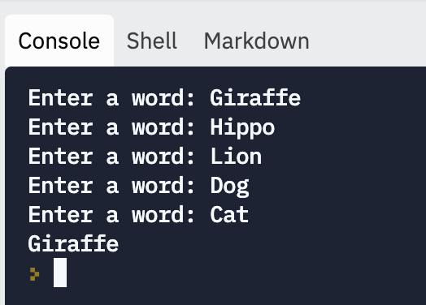

# Longest Word

In this task, you'll ask the user for five words, then display the longest word.

1. Get a list of words from the user. In a loop, prompt the user for a word five times, and append each one to a list.

2. Write a loop over the list of words and find the one that's the longest.

Print it out.

## Sample Run

Here's what the program should look like when run:

## Testing

First, run your code and enter sample words to see that it works.

Then, run the unit tests to check that your code is correct.

# Hints

* The `len()` function can tell you how long a string is, which is how many characters are in the string.
